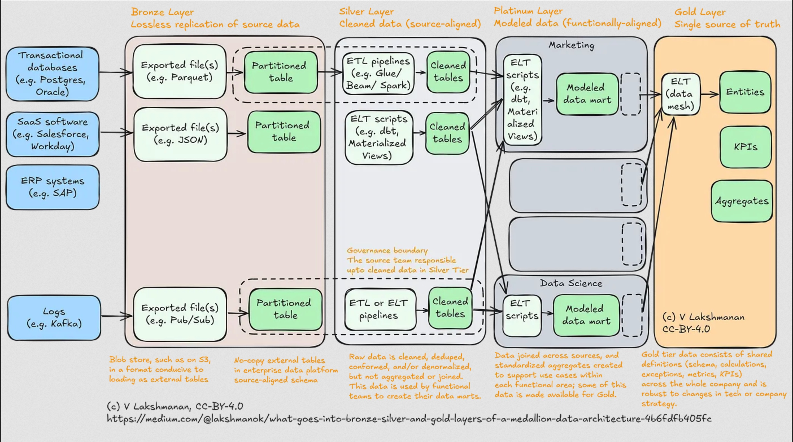

# Data Architecture

The data layout follows a layered structure where each layer adds transformations
taking the data the raw source data to modeled data with business rules applied,
ready for consumption by downstream users such as BI (business intelligence) tools,
ML tools etc.

## Sources

See [data sources](./sources.md) for an overview of the source systems.
