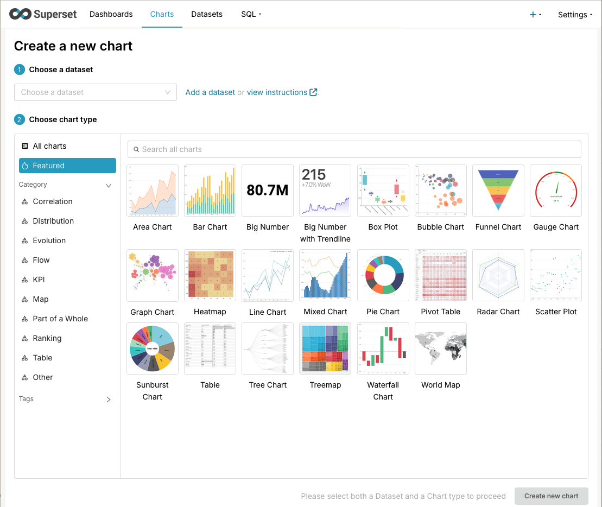
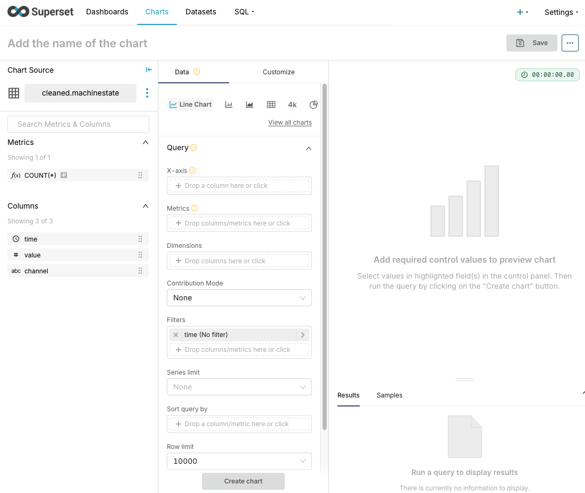

.. _superset-charts:

======
Charts
======

A chart is one of the central elements in Superset. It supports over 50 types
of chart for visualizing data in the most common formats.

Creating a chart
----------------

A new chart can be created from various points:

- On any page click ``+`` button followed by the ``Chart`` link in top right-hand
  corner of any page.
- On the home page by clicking the ``+ Chart`` button in the Charts section.
- On the Datasets page by clicking the name of any dataset.

The first two methods take you to the combined dataset and chart-type selector
page shown in the image below while the final method skips this page and takes
you to the empty chart screen for the selected dataset, with the chart type
set to table.

|

We will use a *Line Chart* as an example. Select a dataset and the *Line Chart*
type then click *Create new chart*.

|

You are presented with the line-chart builder page with your chosen dataset
selected.
